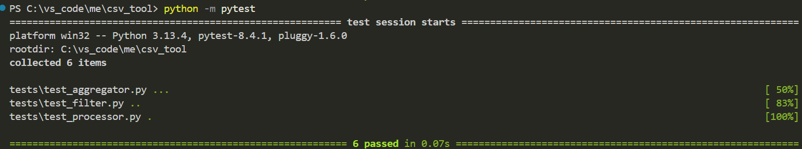
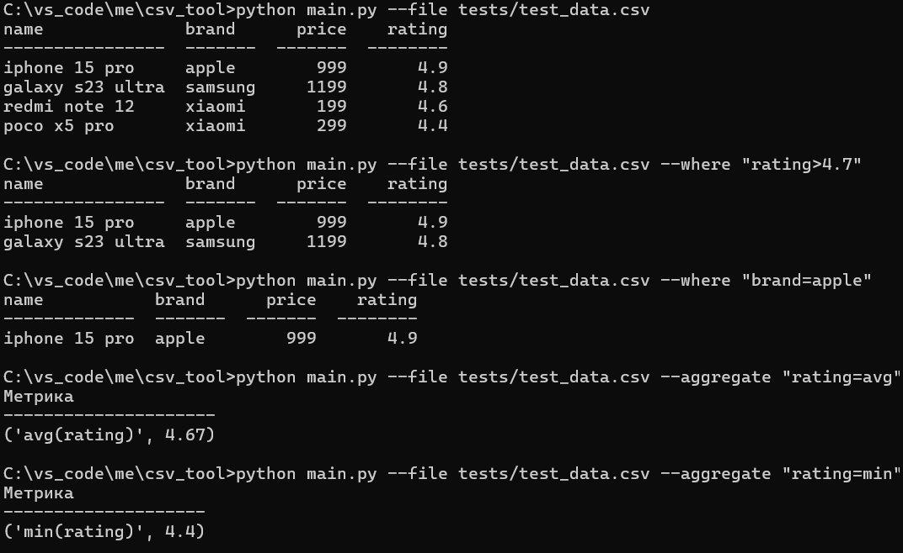

# CSV Tool — фильтрация и агрегация CSV через CLI

Учебный Python-проект: простой скрипт для фильтрации и агрегации данных из CSV-файлов через терминал.

## 📌 Описание

Скрипт позволяет:
- 🔍 фильтровать строки по значениям (`>`, `<`, `=`)
- 📊 агрегировать числовые данные (`avg`, `min`, `max`)
- 📋 красиво выводить таблицу в консоль
- 🧪 запускать модульные тесты через `pytest`

Проект построен на стандартных библиотеках (`csv`, `argparse`) и использует `tabulate` для форматирования таблицы.

## 🚀 Установка

1. Клонируйте репозиторий:
```bash
git clone https://github.com/UsmanGamidov/csv_tool.git
cd csv_tool
```

2. Установите зависимости:
```bash
pip install -r requirements.txt
```

## ⚙️ Примеры запуска

### Вывод всей таблицы:
```bash
python main.py --file tests/test_data.csv
```

### Фильтрация:
```bash
python main.py --file tests/test_data.csv --where "price>500"
```

### Агрегация:
```bash
python main.py --file tests/test_data.csv --aggregate "rating=avg"
```

## 💡 Поддерживаемые опции

| Аргумент        | Описание                          | Пример                        |
|-----------------|-----------------------------------|-------------------------------|
| `--file`        | Путь к CSV-файлу                  | `--file tests/test_data.csv`  |
| `--where`       | Фильтрация (`>`, `<`, `=`)        | `--where "price>500"`         |
| `--aggregate`   | Агрегация (`avg`, `min`, `max`)   | `--aggregate "rating=avg"`    |

## 🧪 Тестирование

### Установка зависимостей:

```bash
pip install -r requirements.txt
```

### Запуск тестов: 

```bash
python -m pytest
```
или
```bash
pytest --cov=coreс
```

✅ Тесты проверяют:
- фильтрацию по числам и строкам
- агрегации `avg`, `min`, `max`
- работу с CSV-файлами и ошибками

### 📷 Пример результата:



### 📷 Ручная проверка:

